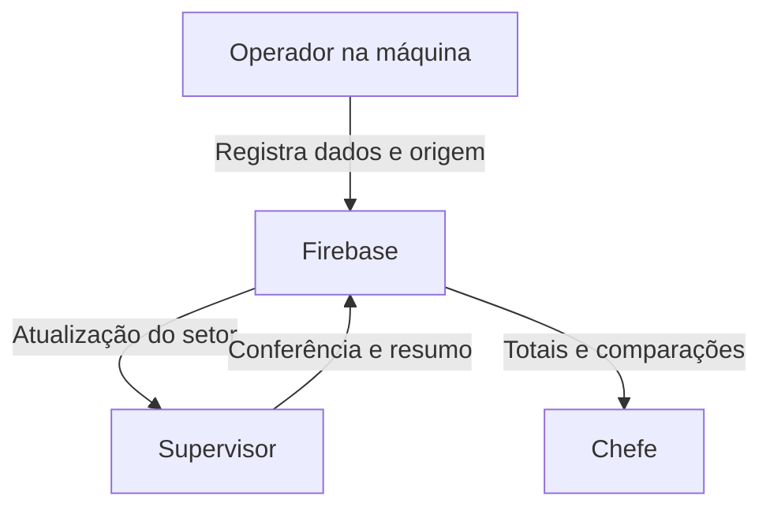

# Arquitetura e telas por cargo

## Análise da base recebida

O ZIP já continha login/cadastro por RE, Firebase configurado, uma estrutura de menu responsivo e chat. As páginas de produção estavam reservadas, sem formulários ou indicadores. O modo de apresentação substituía o serviço Firebase por contas, sessões e conversas armazenadas no navegador. Sua verificação `can()` liberava qualquer ação. Havia seis cargos propostos, diferentes dos três identificados nas entrevistas.

A mudança aproveita essa estrutura e introduz módulos operacionais no conteúdo existente. Não cria três sistemas nem três conjuntos de HTML. Preserva logo, fotografia de entrada, fontes, paleta, estilos base, drawer, foco e interface do chat.

As entrevistas e os materiais mostram a necessidade de substituir papel/foto da IHM/planilha por apontamentos rastreáveis, acompanhar o setor e consolidar a fábrica. Os formulários cobrem produção por período, paradas, refugos, material perdido, peças suspeitas, ocorrências e parâmetros do processo. Peças suspeitas permanecem distintas dos refugos; kg nunca são somados com peças.

## Matriz de telas

O = Operador; S = Supervisor; C = Chefe. Todo acesso autenticado exige perfil ativo.

| Tela | Objetivo e informações | Ações disponíveis | Cargos / tipo de acesso |
| --- | --- | --- | --- |
| Apontamentos | Entrada rápida da operação: máquina em uso, produção por período/turno, produto, lote/ordem, parâmetros e histórico | O seleciona/troca a máquina, registra produção aprovada e leituras; corrige registros próprios | **Exclusiva de O**; cadastro/edição próprios |
| Conferência | Verificar registros do setor e comunicar situação consolidada: pendências de produção, paradas, perdas, ocorrências e leituras | S marca conferência, identifica responsável e escreve resumo do setor com período | **Exclusiva de S**; leitura e atualização da conferência/consolidação |
| Indicadores | Acompanhar a fábrica: produção, metas, atendimento, refugos, kg perdidos, minutos de parada, comparação de setores/máquinas e resumos dos supervisores | C filtra setor, máquina e período; compara desempenho | **Exclusiva de C**; visualização |
| Funcionários | Acompanhar a equipe e garantir que o Operador trabalhe no contexto correto: nome, RE, cargo, setor e máquina | S vincula Operador do seu setor a uma máquina desse setor; C consulta equipe dos setores | **Compartilhada S/C**; S edita vínculo, C visualiza |
| Relatórios | Substituir a consolidação manual em planilhas: resumo por máquina, apontamentos e observações dos supervisores | S/C filtram período e exportam registros CSV; resumos são cadastrados em Conferência | **Compartilhada S/C**; leitura e exportação |
| Visão geral | Resumo do contexto do usuário: aprovadas, refugos, kg, parada, produção por máquina e pendências atuais | Filtrar período; abrir pendências | **Todos**; visualização da máquina O, setor S ou setores C |
| Mapa da Planta | Planta fictícia de setores e equipamentos; supervisório com ciclo, produção, parâmetros, alarmes, paradas e histórico | Selecionar máquina, ampliar, movimentar e filtrar; demonstrar cenários somente na fonte Simulação | **Todos**; simulação fictícia; Registros e API respeitam a máquina O, setor S ou setores C |
| Produção | Acompanhar planejado/realizado e origem dos números: metas, aprovadas, lote, turno, operador, leituras e conferência | Filtrar período/máquina; O corrige produção própria; S confere registros | **Todos**; O edita próprio, S confere, C visualiza |
| Máquinas | Conhecer o equipamento e os parâmetros: código, nome, processo, produto, setor, meta diária e limites | S cadastra/edita máquinas e parâmetros do setor; C altera metas; O consulta sua máquina | **Todos**; permissões de escrita específicas por ação |
| Paradas | Registrar e acompanhar motivo/duração: início/fim, causa/ação, responsável e conferência | O registra/edita parada própria aberta e a encerra; S encerra e confere paradas do setor; C consulta | **Todos**; O/S atualizam conforme escopo, C visualiza |
| Qualidade | Rastrear descarte, material perdido e segregação: tipo, quantidade/unidade, motivo, produto, lote e autor | O registra e corrige entradas próprias; S confere; C consulta | **Todos**; O escreve próprio, S confere, C visualiza |
| Ocorrências | Comunicar problemas da operação: descrição, prioridade, data, autor, situação e resolução | O registra/edita próprias abertas; S registra ação realizada e resolve ocorrências do setor; C consulta | **Todos**; ações por cargo e escopo |
| Chat | Alinhamentos e passagem de turno: mensagens com autor/RE/horário em canais e conversas privadas | Enviar mensagens; consultar histórico; conversar com funcionários | **Todos**; próprio setor + canais gerais + privadas autorizadas; C acessa canais dos setores |
| Notificações | Evidenciar pendências reais: paradas abertas, ocorrências não resolvidas e última leitura fora de limite | Consultar e abrir a tela correspondente | **Todos**; leitura de alertas derivados do contexto |
| Configurações | Explicar o acesso atual: nome, RE, cargo, setor e máquina; preparar catálogo inicial | Todos consultam próprio perfil; S prepara catálogo do setor; C prepara catálogo dos três setores | **Todos**; perfil somente leitura; preparação por S/C |
| Login / Cadastro / Situação do acesso | Identificar o usuário pelo RE | Entrar/sair; cadastrar Nome, RE, Cargo e Senha; tentar conexão novamente | Disponíveis para todos; cadastro imediato, sem setor ou máquina e sem fila de aprovação |

As telas compartilhadas reutilizam os mesmos componentes por cargo. A exclusividade de Indicadores é da página gerencial comparativa: os demais cargos continuam vendo indicadores úteis ao seu trabalho em Visão geral e Produção. Alterar meta é uma ação do Chefe na página compartilhada Máquinas, não uma página adicional.

## Fluxo de acesso

1. Cadastro/login identifica a conta pelo RE no Firebase Authentication. O perfil em `perfis/{uid}` contém o cargo e campos inicialmente vazios para o contexto atual.
2. A página inicial dos três cargos é `visao-geral`, adaptada ao contexto. Apontamentos, Conferência e Indicadores mantêm acesso exclusivo por cargo.
3. O menu exibe apenas páginas permitidas. O escolhe a máquina em uso, que determina o setor; S escolhe o setor em acompanhamento no cabeçalho; C filtra um setor ou todos. Nenhum setor é fixado no cadastro.
4. Uma URL/hash não autorizado é substituído pela página inicial do cargo. Os comandos do serviço também verificam permissões, propriedade e escopo.
5. As regras do Realtime Database verificam o perfil autenticado, a máquina/setor atual, o autor e os campos permitidos. O catálogo de máquinas é compartilhado para seleção; registros operacionais exigem a máquina de O ou o setor atual de S. C não grava apontamentos.
6. O próprio Operador pode mudar a máquina entre setores. S também pode alterar a máquina de um Operador atualmente no setor em acompanhamento. O perfil observado atualiza a sessão: assinaturas antigas param e os dados do novo contexto carregam. Registros históricos mantêm o equipamento, o setor e o autor originais.
7. Sair/bloquear a sessão limpa a interface e interrompe assinaturas, incluindo os dados operacionais.

Há apenas três cargos. As políticas ficam em `config.js` e são usadas por `rbac.js`, navegação e serviços. Não existe coleção de cargos duplicando essas três constantes.

## Fluxo da informação

A conferência informa que o Supervisor verificou um apontamento; não é aprovação para publicá-lo. O dado já participa dos indicadores após a confirmação do Firebase. Uma correção altera o mesmo ID, mantém a origem e reinicia a indicação de conferência.

## Estrutura dos dados

| Caminho | Conteúdo e vínculos |
| --- | --- |
| Firebase Authentication | UID e credenciais; senha não fica no Realtime Database |
| `perfis/{uid}` | `nome`, `re`, `cargo`, `status`, `createdAt`; `setorId`/`maquinaId` representam o contexto atual, vazio no cadastro; `cargoSolicitado` pode permanecer em perfis legados |
| `setores/{setorId}` | Nome do setor; catálogo inicial Selagem, Injeção e Montagem de abafadores |
| `maquinas/{maquinaId}` | Nome, setor, processo, produto padrão, meta diária, parâmetros/limites e metadados de criação/atualização |
| `registrosProducao/{id}` | Peças aprovadas, início/fim, turno, produto, lote/ordem e observação |
| `leituras/{id}` | Valores por identificador de parâmetro, data, lote/ordem e observação |
| `paradas/{id}` | Início, fim (`0` enquanto aberta), motivo, causa/ação e usuário que encerrou |
| `perdas/{id}` | Tipo (`refugo`, `perda`, `suspeito`), quantidade, unidade (`pecas` ou `kg`), motivo, produto, lote/ordem e data |
| `ocorrencias/{id}` | Descrição, prioridade, data, situação e ação de resolução |
| `consolidacoes/{id}` | Setor, Supervisor/RE, período, observação e data de criação; totais são calculados, não copiados |
| `diretorio/{uid}` | Nome/RE/cargo/setor mínimos para o chat; não contém senha ou perfil completo |
| `conversas/{id}` | Participantes de uma conversa privada |
| `mensagens/{conversaId}/{chave}` | Texto, autor/RE, horário, chave do envio e identificação da conversa |

Cada apontamento operacional inclui `usuarioId`, `usuarioRe`, `maquinaId`, `setorId`, `createdAt`, `updatedAt`, `atualizadoPor` e `verificado`. Quando conferido, inclui `verificadoPor` e `verificadoEm`. Os IDs ligam as entidades; o RE preserva a identificação no momento do registro. Nome de máquina, setor e perfil são resolvidos pelos cadastros.

Índices por setor e máquina permitem consultar apenas os dados autorizados. Os indicadores e as notificações são derivados dessas coleções; não existe uma coleção `indicadores` com cópias dos mesmos totais. A consolidação guarda a análise do Supervisor e referencia um período, mantendo o relatório atualizado quando um apontamento é corrigido.

## Cálculos e limites do protótipo

- Produção é o total de **peças aprovadas**, informado por período. O total do período é classificado pelo horário final do apontamento. Quantidades não são proporcionalmente divididas entre dias.
- Taxa de refugo = peças refugadas / (aprovadas + refugadas). Material em kg e peças suspeitas não entram nesse denominador.
- Meta do período = soma das metas diárias das máquinas selecionadas × dias selecionados. Sem calendário de turnos/feriados. Não é OEE.
- Minutos de parada somam intervalos por máquina, cortados pelo período e pelo horário atual. Sobreposições na mesma máquina são unidas para evitar contagem dupla.
- Situação da máquina indica presença de parada registrada; não é sinal de funcionamento vindo de CLP/IoT.
- Alertas de parâmetro comparam a leitura mais recente com os limites atualmente cadastrados. Não há versionamento de receita ou certificado de capacidade estatística.
- Os parâmetros não têm limite artificial de três zonas: o formulário permite adicionar até 100 parâmetros, incluindo valores negativos como vácuo. Limite máximo precisa superar o mínimo.
- Cp/Cpk, teste de normalidade, OCR, IoT, calendário de produção e integração com outros sistemas ficam fora desta implementação. A planilha recebida contém limites/campos que exigem revisão; não transformamos seus resultados em indicadores certificados.
- Há uma máquina em uso por Operador; ele pode escolher qualquer máquina cadastrada no Firebase e trocar de setor mantendo o mesmo RE. O Supervisor acompanha um setor por vez, com troca pelo cabeçalho. A origem dos registros não depende do contexto atual do funcionário.
