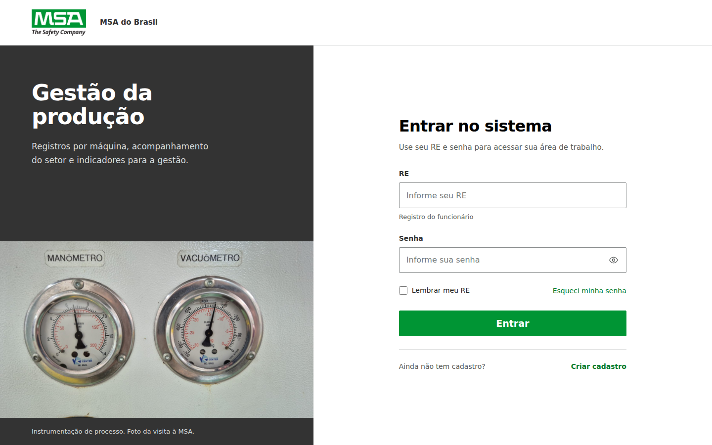
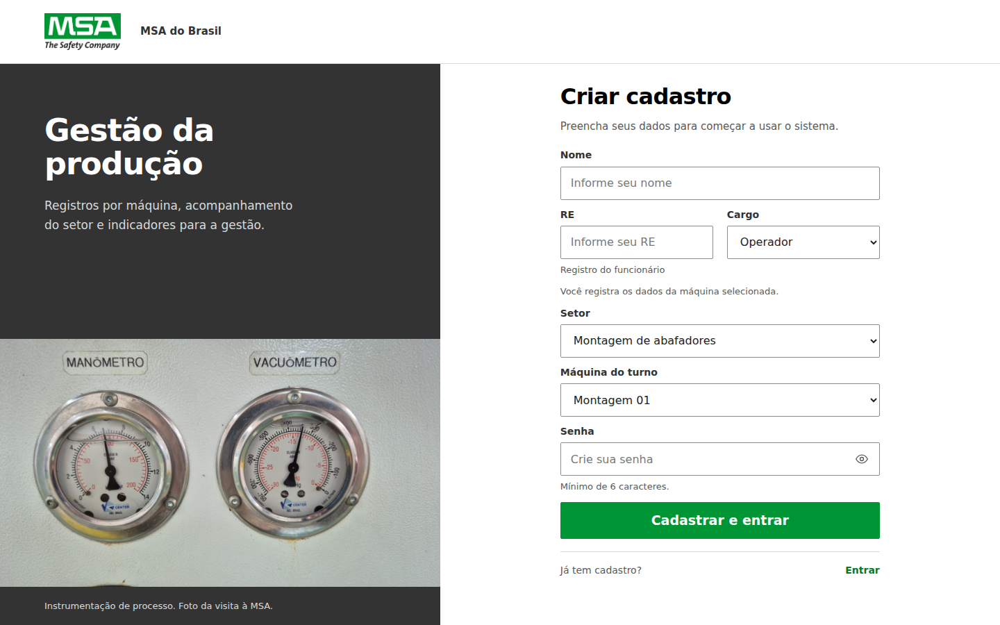
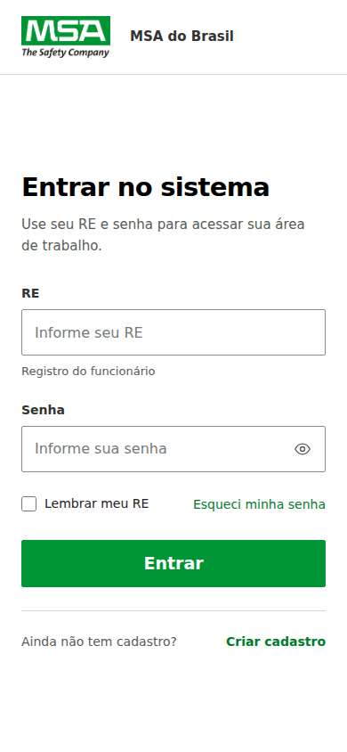
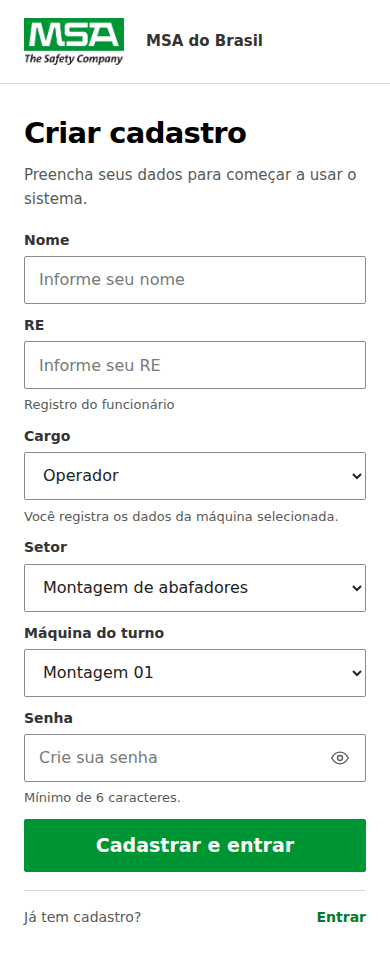
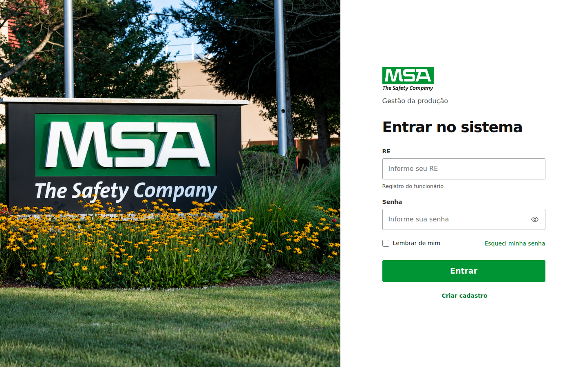
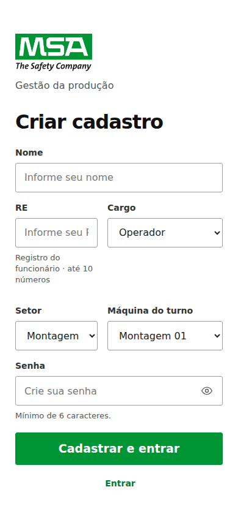

# Login e Cadastro MSA — versão 0.4.1

**Atualização 0.4.2:** a composição visual abaixo foi preservada. Setor e máquina saíram do Cadastro porque os funcionários circulam entre setores; a escolha da máquina agora acontece durante a operação. O fluxo atualizado está em [Cadastro-por-RE.md](Cadastro-por-RE.md). As capturas 0.4.1 documentam a versão anterior.

## Análise realizada antes das alterações

Foram lidos os dois HTMLs, o alias `login.html`, o CSS e os scripts de
autenticação, validação e apresentação. As telas anteriores foram abertas e
capturadas em 1440 × 900 e 390 × 844 antes da edição. A direção visual foi
apresentada ao usuário antes de implementar.

| Tela | Fragilidade observada | Consequência |
| --- | --- | --- |
| Login | Fotografia do jardim e letreiro ocupava 58% da tela. Formulário de 400 px isolado no restante. Marca, nome do sistema e título empilhados. | A imagem dominava a composição; o trabalho nas máquinas quase não aparecia na identidade da página. |
| Cadastro | RE, cargo, setor e máquina compartilhavam uma grade de colunas desiguais. A ajuda do RE quebrava em várias linhas. | Setor aparecia truncado; espaço irregular entre linhas; seletores estreitos no celular. |
| Ambas | A composição dependia da fórmula fotografia ampla ao lado de um formulário. Em telas pequenas, todo o contexto visual desaparecia. | Aparência intercambiável com formulários de outros serviços; pouca identidade do processo produtivo. |

Os elementos que já tinham qualidade foram preservados: logo original,
paleta MSA, campos com labels, controles de senha, estados de validação,
preenchimento automático, login por RE e cadastro imediato. Os problemas
observados eram principalmente de composição, distribuição e hierarquia.

## Direção visual

Um cabeçalho comum identifica a MSA; em desktop, a coluna de contexto ocupa
44% e reúne o nome do sistema com uma fotografia real dos instrumentos;
o formulário ocupa a área branca restante, com largura máxima de 460 px.
Os textos e campos são alinhados à esquerda. O botão principal fica centrado
no próprio controle. Superfícies planas e limites claros aproximam a composição
de um sistema de trabalho industrial.

| Token | Cor | Uso |
| --- | --- | --- |
| MSA Green | `#009534` | Ação principal e foco dos controles |
| Preto | `#000000` | Títulos do formulário |
| Cinza carvão | `#333333` | Área de contexto e labels |
| Cinza de leitura | `#575B58` | Orientação e ajuda dos campos |
| Cinza de divisão | `#D8DADA` | Separação entre áreas e texto sobre carvão |
| Branco | `#FFFFFF` | Formulários, cabeçalho e texto do contexto |

Links e erros continuam utilizando os tons funcionais já existentes no CSS
base. O verde não é usado como fundo de uma grande área.

A família Arial foi preservada por continuidade com o protótipo e legibilidade
dos controles corporativos. A personalidade vem da composição e da fotografia
do processo. A escala distingue o nome do sistema (36–46 px), o título da ação
(32 px em desktop e 29 px no celular), os campos (16 px), labels (14 px) e ajuda
(13 px). O botão mantém 19 px em negrito, favorecendo leitura e contraste com
o verde MSA. Não há fonte externa nem nova dependência.

O plano foi revisado para evitar adereços: a fotografia da visita é o elemento
de destaque. O restante orienta o acesso. Não foram acrescentados indicadores
fictícios, ícones de função decorativa, selos de segurança, cartões, gradientes,
animações de entrada ou uma imitação interativa da máquina.

## O que permaneceu, saiu ou mudou

| Elemento | Decisão | Função |
| --- | --- | --- |
| Logo MSA | Mantido sem editar a imagem; uma ocorrência por tela | Identificar o sistema e preservar a marca |
| Fotografia do jardim | Retirada das duas páginas; arquivo original preservado | Dar lugar a conteúdo ligado à operação documentada |
| Fotografia de manômetro e vacuômetro | Acrescentada com legenda de origem | Relacionar o acesso à medição e ao ambiente industrial real |
| Cabeçalho da marca | Compartilhado entre Login e Cadastro | Unir as áreas da composição e conservar a identificação no celular |
| Títulos e orientações | Escala e espaçamento ajustados | Explicar a ação e o preenchimento sem texto de marketing |
| RE e cargo no Cadastro | Colunas iguais em desktop; linhas completas no celular | Organizar a identificação sem comprimir os campos |
| Setor e máquina | Cada um ocupa uma linha completa | Exibir os nomes e adaptar o formulário ao cargo sem lacunas na grade |
| Orientação do cargo | Texto atualizado ao selecionar Operador, Supervisor ou Chefe | Explicar o alcance do perfil escolhido sem adicionar campos ou etapas |
| Lembrança do RE | Label “Lembrar meu RE”; controle e lógica mantidos | Descrever com clareza o dado que será preenchido no retorno |
| Acesso ao outro formulário | Texto curto e link separados da ação principal | Facilitar primeiro acesso e retorno ao login |
| Link para pular ao formulário | Destino recebe foco pelo teclado | Tornar a navegação direta utilizável |

No Login continuam RE, Senha, Entrar, lembrança, recuperação de acesso e
acesso ao Cadastro. No Cadastro continuam Nome, RE, Cargo, Setor,
Máquina do turno e Senha. As regras existentes de apresentação se mantêm:
Operador escolhe setor e máquina; Supervisor escolhe setor; Chefe usa o escopo
geral. O botão continua “Cadastrar e entrar”, com entrada imediata após sucesso.

Em larguras de até 1000 px, o formulário e a marca têm prioridade; a fotografia
e o texto lateral deixam de ocupar espaço. Em até 600 px, a grade de RE/cargo
vira uma coluna. Formulários longos permitem rolagem vertical natural.
Em 1440 × 900, o Cadastro completo cabe na altura da página; em 1280 × 800,
o botão de cadastro fica visível e o link inferior pode exigir rolagem.

## Skills utilizadas

Foi lida e aplicada a skill **Frontend Design**, recebida como `SKILL.md`
(referida pelo usuário como Frontend Design Deslop). Foram aplicados o processo
de análise antes do código, fundamentação no assunto, revisão do plano,
hierarquia tipográfica, contenção visual e crítica por capturas reais.

**Better Web UI** não foi recebida e não consta nas skills disponíveis na sessão.
A implementação não atribui recomendações a esse material. Os requisitos
visuais explícitos do usuário orientaram a solução junto à skill anexada.

## Verificação

- Inspeção de capturas reais após os ajustes de composição e de espaçamento.
- Login e Cadastro verificados em 1920 × 1080, 1440 × 900, 1280 × 800,
  1024 × 768, 768 × 1024, 390 × 844 e 320 × 640.
- Sem rolagem horizontal; largura dos seletores verificada contra a largura
  do texto escolhido, incluindo “Montagem de abafadores”.
- Conferidos envio dos campos, zeros iniciais do RE, três cargos, setores e
  máquinas condicionais, troca de cargo de volta para Operador, senha visível,
  links entre telas, recuperação por diálogo, validação, erros e foco.
- Cadastro sem etapas adicionais; campo oculto/desabilitado não é enviado
  para cargos que não o utilizam.
- Verificada navegação por teclado, foco visível e preferência de movimento
  reduzido. Inputs e seletores mantêm altura confortável.
- `npm test`: 33 testes passaram; o teste opcional de regras reais foi omitido
  nesta revisão visual, pois requer iniciar o emulador. A integração e as regras
  não foram alteradas.
- `npm run build`: o pacote estático e o Worker incluem o CSS e a nova fotografia.

Nos testes de navegador, apenas a fronteira de autenticação foi substituída
no servidor local para conferir o contrato de envio e o redirecionamento.
O HTML, CSS, configuração de cargos, validação e script dos formulários eram
os arquivos reais. Essa revisão não criou contas nem executou login no Firebase
remoto. O serviço de autenticação de produção permaneceu idêntico.

## Arquivos desta atualização

| Arquivo | Alteração |
| --- | --- |
| `dist/index.html` | Estrutura do Login e cabeçalho comum |
| `dist/login.html` | Mesmo Login, preservando o alias existente |
| `dist/cadastro.html` | Organização dos campos e orientações |
| `dist/assets/auth-layout.css` | CSS novo, limitado a `.auth-page` |
| `dist/assets/auth-ui.js` | Apenas orientação textual por cargo |
| `dist/assets/msa-instrumentacao.jpg` | Foto enviada pelo grupo, sem edição |
| `dist/server/index.js` | Build regenerado com os novos ativos |
| `README.md` | Versão e referência para este documento |
| `ASSETS.md` | Origem e uso da fotografia |
| `package.json`, `package-lock.json` | Versão 0.4.1; mesmas dependências |
| `docs/Alteracoes.md`, `docs/Design-acesso.md` | Registro das decisões e do escopo |
| `docs/preview/` | Capturas das páginas anteriores e atuais |

`styles.css`, os módulos operacionais, o chat, RBAC, validação, o serviço de
autenticação, a configuração Firebase e as regras do banco mantêm os mesmos
bytes da versão anterior. O CSS novo só é carregado pelas páginas de acesso.

## Capturas

Login e Cadastro atuais em desktop:

Versões para celular:

Referências anteriores à edição:

