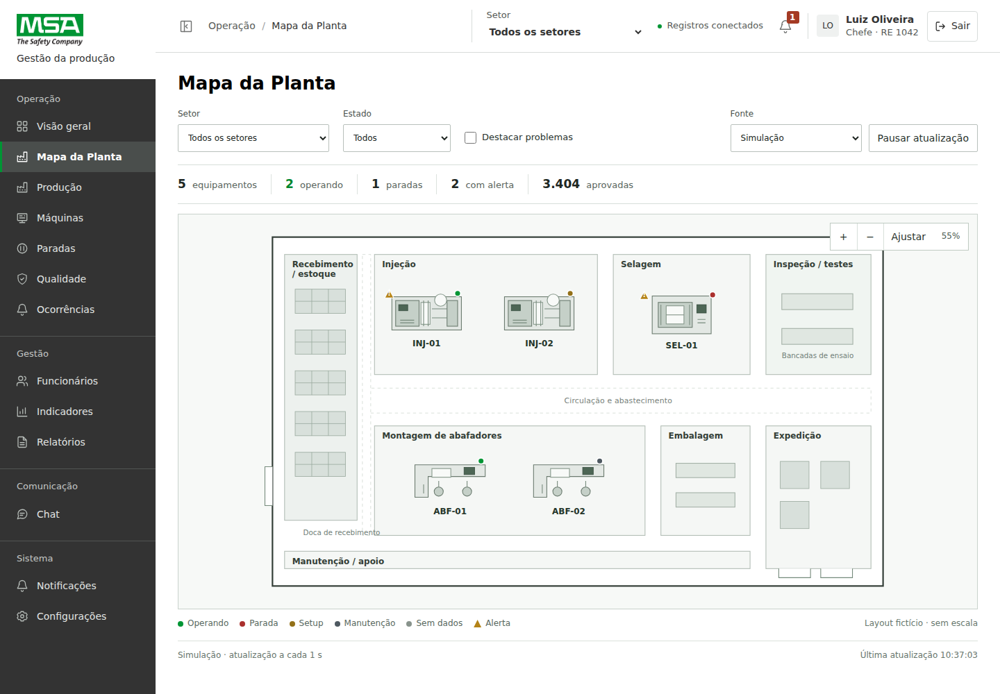

# Mapa da Planta — versão 0.5.0

> A interface foi reformulada na versão 0.6.0. Veja [Mapa e supervisório visual](Mapa-da-Planta-Visual.md) e [plano da reformulação](Plano-da-reformulacao.md). As seções técnicas abaixo descrevem a base preservada.

## Referências e direção

O AriLine foi usado como referência para localizar setores e selecionar equipamentos. O vídeo do supervisório Altus/Tatsoft orientou a relação entre desenho do processo, estado, medições, ciclo, perdas e histórico. A solução preserva a estrutura atual da MSA, com branco, cinzas, navegação em carvão e verde `#009534`, sem reproduzir a interface de nenhuma das referências.

O desenho é fictício e sem escala. Injeção, selagem e montagem de abafadores utilizam os cinco equipamentos do catálogo de exemplo atual. Recebimento/estoque, inspeção/testes, embalagem, expedição e manutenção/apoio completam o fluxo plausível. Os corredores separam as áreas e permitem reconhecer uma planta industrial.



Capturas do [supervisório de injeção no computador](supervisor-injecao-desktop.png) e do [processo no celular](supervisor-processo-mobile.png). As capturas usam perfil de teste e dados simulados.

## Uso

1. Entre no sistema e abra **Mapa da Planta** no menu.
2. Selecione setor, estado ou **Destacar problemas**. O resumo considera as máquinas destacadas pelos filtros.
3. Amplie pelos botões ou pela roda do mouse. Arraste para movimentar. Em dispositivos de toque, é possível ampliar com dois dedos.
4. Passe o mouse ou use Tab em um equipamento para consultar nome, código, estado e produção.
5. Clique ou pressione Enter/Espaço para abrir o supervisório. **Voltar à planta** conserva a posição, ampliação e filtros.
6. Na fonte **Simulação**, pause a atualização ou altere o cenário do equipamento. Esses controles modificam apenas a demonstração.

O mapa também aceita setas para movimentação quando o SVG está em foco, `+`/`−` para ampliar/reduzir e `0` para ajustar. As abas do supervisório aceitam setas, Home e End. Estados têm rótulos textuais, além dos pequenos marcadores coloridos. Alerta é independente do estado: uma máquina pode operar com um parâmetro em desvio.

## Supervisório

O equipamento ocupa o conteúdo da página, com retorno direto à planta. Cada processo tem seu desenho funcional: molde/cilindro/extração na injeção; alimentação/prensa/saída na selagem; bancadas/prensagem/inspeção na montagem.

| Área | Informações |
| --- | --- |
| Identificação | Código, nome, processo, produto, setor, estado e início do estado |
| Linha principal | Produção aprovada, meta diária, último ciclo, ritmo atual, tempo operando e refugos |
| Operação | Etapa atual, avanço de ciclo, ciclo de referência, pontos de medição, limites, alarmes, sequência de estados e tendência do ciclo |
| Paradas e eficiência | Disponibilidade, desempenho, qualidade, OEE, tempos de parada/setup/manutenção e intervenções com início, fim e motivo |
| Qualidade | Total, aprovadas, refugos e taxa de refugo; apontamentos mantêm peças suspeitas e kg separados |
| Histórico | Eventos de estado/alarme/leitura/ocorrência em ordem de horário e tendência do ciclo |

O OEE é calculado por **disponibilidade × desempenho × qualidade**. Disponibilidade é tempo operando/tempo planejado; desempenho é ciclo ideal por peça × total/tempo operando; qualidade é aprovadas/total. A meta diária permanece um indicador distinto. OEE não é exibido quando os dados necessários faltam ou são inconsistentes.

## Fontes de dados

| Fonte | Comportamento |
| --- | --- |
| Simulação | Atualização em memória a cada segundo, contagem por ciclos completos, refugos, alarmes e eventos fictícios. Parada/setup/manutenção não produzem. Pausa congela a demonstração e não acumula produção durante o intervalo. |
| Registros do sistema | Leitura das coleções já existentes no Firebase, respeitando o cargo/contexto. Uma parada aberta informa “Parada”. Ausência de parada não é tratada como prova de operação. Ciclo, velocidade, tempo operando e OEE permanecem indisponíveis sem telemetria. |
| API / IoT | Disponível após conectar um adaptador por `MSA.telemetry.useAdapter()`. Não existe gateway real configurado nesta versão. Leituras mais antigas são descartadas; após 15 segundos sem leitura, a interface sinaliza dados desatualizados. |

O catálogo simulado é separado do catálogo operacional. Na fonte Registros, uma máquina cadastrada posteriormente aparece em **Equipamentos sem posição na planta** até que sua geometria seja definida. O Operador consulta sua máquina, o Supervisor o setor em acompanhamento e o Chefe todos os setores. O controle de acesso também deve existir no futuro serviço de telemetria.

Simulação não chama comandos de gravação do Firebase. Os valores e eventos fictícios reiniciam ao recarregar a página. Cenário é um controle de demonstração e não envia comandos a máquinas físicas. Na API, o histórico exibido é recebido da fonte; o armazenamento durável deverá ser feito pelo serviço de integração.

## Ajustar ao layout real

Em `dist/assets/plant-layout.js`, substitua as áreas/corredores e as posições em `placements`. Cada posição usa o mesmo ID do catálogo (`INJ-01`, por exemplo), coordenadas, rotação e tipo de equipamento. As coordenadas são internas ao SVG; as dimensões atuais não representam metros.

Para novos setores, atualize o catálogo de setores em `dist/assets/config.js` e sua geometria. Para um processo diferente, acrescente o desenho de planta e o diagrama funcional em `dist/js/plant-ui.js`. Os dados não dependem dessas coordenadas.

## Contrato para a integração

Um gateway pode receber sinais do CLP/IoT e publicar amostras por API, SSE ou WebSocket. O navegador recebe dados normalizados por equipamento; não precisa conhecer endereços ou tags do CLP.

Exemplo de amostra normalizada:

```json
{
  "id": "INJ-01",
  "updatedAt": 1791374400000,
  "state": "operando",
  "stateSince": 1791370800000,
  "phase": "Resfriamento",
  "periodStart": 1791360000000,
  "periodLabel": "Turno 1",
  "totalCount": 600,
  "goodCount": 592,
  "rejectedCount": 8,
  "goal": 1800,
  "cycleSeconds": 26,
  "idealCycleSeconds": 24,
  "cycleProgress": 0.55,
  "partsPerCycle": 1,
  "speed": 2.3,
  "plannedSeconds": 18000,
  "operatingSeconds": 15600,
  "stopSeconds": 1800,
  "setupSeconds": 600,
  "maintenanceSeconds": 0,
  "parameters": {
    "temperatura": {
      "nome": "Temperatura do cilindro",
      "value": 248.5,
      "unidade": "°C",
      "min": 230,
      "max": 260,
      "updatedAt": 1791374400000
    }
  },
  "alarms": [],
  "timeline": [],
  "events": [],
  "samples": []
}
```

Tempos acumulados estão em segundos; timestamps em milissegundos UTC; avanço do ciclo entre 0 e 1; ritmo em peças/minuto. Contadores e tempos precisam corresponder ao mesmo período. `partsPerCycle` permite molde com múltiplas cavidades; o cálculo de desempenho utiliza o ciclo ideal dividido por esse valor.

Estados aceitos: `operando`, `parada`, `setup`, `manutencao` e `desconhecido`. Alarmes utilizam `code`, `description`, `severity`, `since`, `active` e, opcionalmente, `parameterId`. Eventos usam `id`, `time`, `type`, `description` e `state`; intervalos usam `state`, `start`, `end` e `reason`; tendências usam `time` e `cycleSeconds`.

Exemplo de adaptador SSE, a conectar quando o backend existir:

```js
MSA.telemetry.useAdapter({
  name: 'Gateway de produção',
  subscribe(onSample, onError) {
    const stream = new EventSource('/api/telemetria');
    stream.onmessage = event => {
      try { onSample(JSON.parse(event.data)); }
      catch { onError(); }
    };
    stream.onerror = onError;
    return () => stream.close();
  }
});
```

O endpoint `/api/telemetria` é um exemplo de contrato, não uma rota implementada. O serviço deve validar a sessão e o escopo, converter tags/unidades e registrar eventos/paradas com timestamps da origem. Segredos e acesso ao CLP pertencem ao gateway. Para trocar a fonte, forneça outro adaptador; não é necessário redesenhar a página.

## Arquivos e verificação

Geometria: `dist/assets/plant-layout.js`. Fontes/cálculos: `dist/assets/telemetry-service.js`. Interface: `dist/js/plant-ui.js`. Estilos: `dist/assets/plant.css`. Integrações menores: navegação, permissões e ciclo da sessão.

`npm test` verifica ciclos, contadores, tempos, pausa, OEE, mensagens antigas, desatualização e recuperação. `npm run test:plant` exercita o HTML real com Playwright, identidades e dados controlados em memória, sem acessar o Firebase. Capturas geradas em testes locais podem ser consultadas junto desta documentação.
